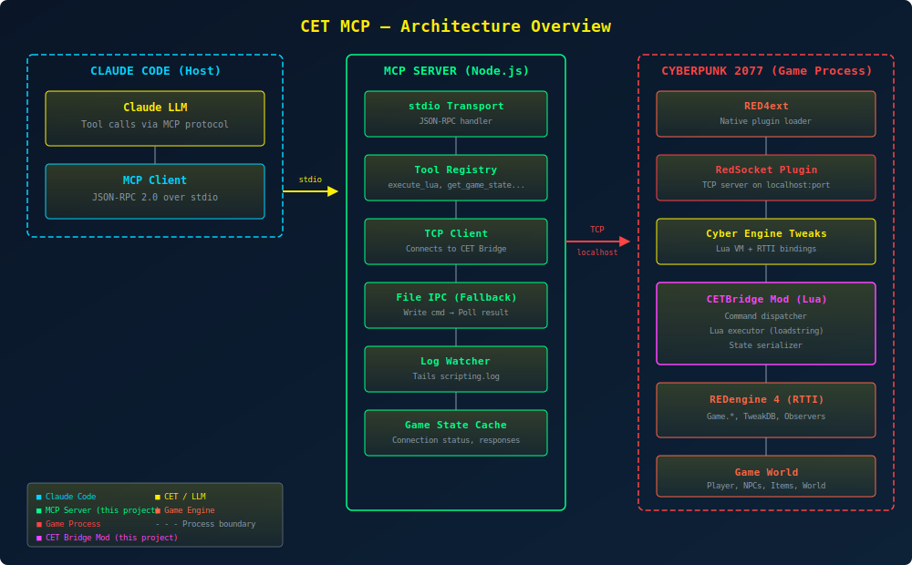
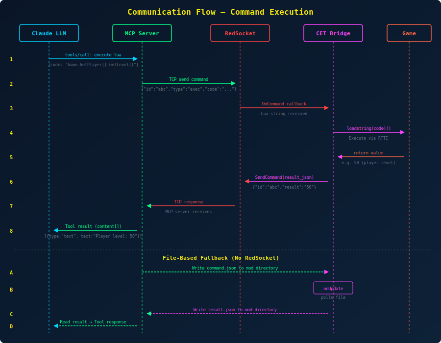
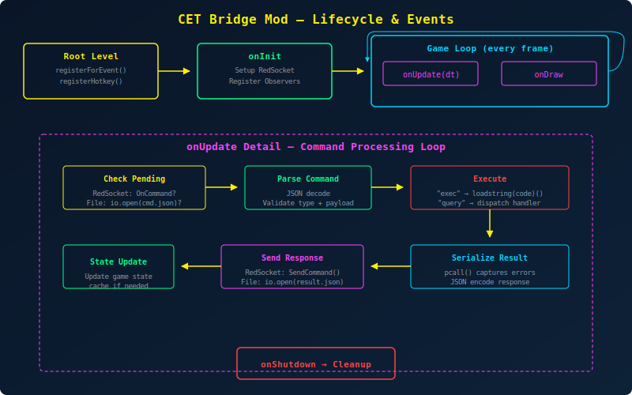
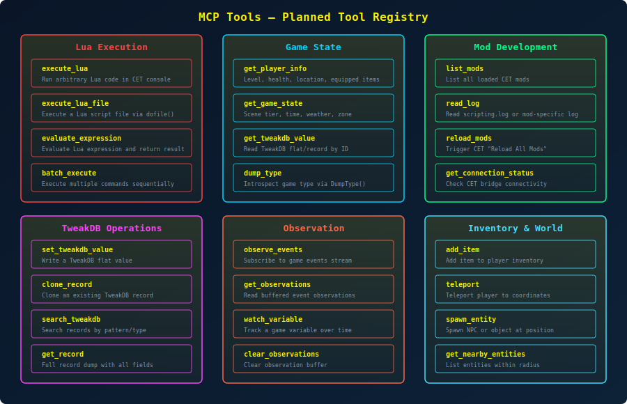

# CET MCP — Architecture Documentation

A Model Context Protocol (MCP) server that bridges Claude Code with Cyber Engine Tweaks (CET) running inside Cyberpunk 2077, enabling AI-assisted game modding and real-time console interaction.

## System Overview



The system consists of three components spanning two OS processes:

| Component | Language | Process | Role |
|-----------|----------|---------|------|
| **MCP Server** | TypeScript (Node.js) | Claude Code subprocess | Exposes tools to Claude, manages TCP/file bridge |
| **CET Bridge Mod** | Lua | Cyberpunk 2077 game | Receives commands, executes in CET Lua VM, returns results |
| **RedSocket** | C++ (RED4ext plugin) | Cyberpunk 2077 game | Provides TCP socket API to CET Lua environment |

## Communication Architecture



### Primary: TCP via RedSocket

The recommended transport uses [RedSocket](https://github.com/rayshader/cp2077-red-socket), a RED4ext plugin that adds TCP socket capabilities to CET's Lua environment.

**Flow:**
1. Claude Code invokes an MCP tool (e.g., `execute_lua`)
2. MCP Server serializes the command as JSON and sends it over TCP to `localhost:<port>`
3. RedSocket delivers the data to the CET Bridge Mod via `OnCommand` callback
4. The Bridge Mod parses the command, executes it in the CET Lua VM (via `loadstring()` or a dispatch table)
5. The result is serialized as JSON and sent back through RedSocket
6. MCP Server receives the response and returns it to Claude Code as a tool result

**Protocol format (JSON over TCP, `\r\n` delimited):**
```json
// Request
{"id":"uuid","type":"exec","code":"Game.GetPlayer():GetLevel()"}
{"id":"uuid","type":"query","handler":"player_info"}
{"id":"uuid","type":"tweakdb","op":"get","path":"Items.Preset_Katana_Saburo"}

// Response
{"id":"uuid","ok":true,"result":"50"}
{"id":"uuid","ok":false,"error":"attempt to index nil value"}
```

### Fallback: File-Based IPC

When RedSocket is not installed, the system falls back to file-based communication:

1. MCP Server writes `command.json` to the CET Bridge Mod directory
2. The Bridge Mod polls for the file in `onUpdate` (every frame, ~16ms at 60fps)
3. After execution, the mod writes `result.json`
4. MCP Server polls for and reads the result file

**Latency:** ~16-33ms per command (1-2 frames) vs ~1ms with TCP.

## CET Bridge Mod Lifecycle



### Event Registration (Root Level)
```lua
registerForEvent("onInit", onInit)
registerForEvent("onUpdate", onUpdate)
registerForEvent("onDraw", onDraw)
registerForEvent("onShutdown", onShutdown)
```

### onInit — Setup
- Initialize RedSocket connection (or file-based polling)
- Register command handlers in the dispatch table
- Set up error handling wrappers

### onUpdate — Command Loop
Each frame:
1. Check for pending commands (TCP message or file)
2. Parse JSON command
3. Route to appropriate handler based on `type` field
4. Execute in protected call (`pcall`) to capture errors
5. Serialize and send response

### onShutdown — Cleanup
- Close RedSocket connection
- Clean up temporary files

## MCP Tool Registry



### Core Tools

| Tool | Category | Description |
|------|----------|-------------|
| `execute_lua` | Execution | Run arbitrary Lua code in CET console |
| `evaluate_expression` | Execution | Evaluate a Lua expression and return the result |
| `batch_execute` | Execution | Execute multiple Lua statements sequentially |
| `get_player_info` | Game State | Get player level, health, position, equipment |
| `get_game_state` | Game State | Get scene tier, in-game time, weather, zone type |
| `get_tweakdb_value` | TweakDB | Read a TweakDB flat or record |
| `set_tweakdb_value` | TweakDB | Write a TweakDB flat value |
| `dump_type` | Game State | Introspect a game type's methods and properties |
| `list_mods` | Dev Tools | List all loaded CET mods |
| `read_log` | Dev Tools | Read CET scripting.log or mod-specific logs |
| `get_connection_status` | Dev Tools | Check bridge connectivity status |

### Extended Tools (Phase 2)

| Tool | Category | Description |
|------|----------|-------------|
| `observe_events` | Observation | Subscribe to game event callbacks |
| `get_observations` | Observation | Read buffered event observations |
| `add_item` | Inventory | Add item to player inventory |
| `teleport` | World | Teleport player to coordinates |
| `search_tweakdb` | TweakDB | Search records by pattern |
| `clone_record` | TweakDB | Clone a TweakDB record |
| `reload_mods` | Dev Tools | Trigger CET mod hot-reload |

## Dependencies

### Required
- **Node.js** >= 18 — MCP Server runtime
- **Cyber Engine Tweaks** >= 1.32 — Lua scripting framework
- **RED4ext** >= 1.25 — Native plugin loader (CET dependency)
- **Cyberpunk 2077** — The game

### Recommended
- **RedSocket** ([cp2077-red-socket](https://github.com/rayshader/cp2077-red-socket)) — TCP transport (without it, falls back to file-based IPC)

### Development
- **TypeScript** — MCP server language
- **@modelcontextprotocol/sdk** — Official MCP TypeScript SDK
- **Zod** — Input schema validation

## Security Considerations

- The TCP server binds to `localhost` only — no remote access
- The CET Bridge Mod executes arbitrary Lua code — this is by design for development use
- RedSocket is explicitly documented as "insecure by design" — intended for local use only
- No authentication is implemented — the bridge assumes trusted local access
- **This is a development tool, not intended for production/multiplayer use**

## Project Structure

```
cyber-engine-tweak-mcp/
├── src/                          # MCP Server (TypeScript)
│   ├── index.ts                  # Entry point, stdio transport setup
│   ├── server.ts                 # MCP server + tool registration
│   ├── transport/
│   │   ├── tcp-client.ts         # TCP client for RedSocket
│   │   └── file-bridge.ts        # File-based IPC fallback
│   ├── tools/
│   │   ├── execution.ts          # execute_lua, evaluate, batch
│   │   ├── game-state.ts         # player info, game state, dump
│   │   ├── tweakdb.ts            # TweakDB read/write/search
│   │   ├── dev-tools.ts          # logs, mods, reload, status
│   │   └── observation.ts        # event observation tools
│   └── utils/
│       ├── protocol.ts           # JSON command/response protocol
│       └── serializer.ts         # Lua value serialization
├── cet-mod/                      # CET Bridge Mod (Lua)
│   └── CETBridge/
│       ├── init.lua              # Mod entry point, event registration
│       ├── bridge.lua            # Command dispatcher + executor
│       ├── handlers.lua          # Built-in query handlers
│       ├── serializer.lua        # Lua → JSON serializer
│       └── config.lua            # Bridge configuration (port, etc.)
├── docs/
│   ├── architecture.md           # This file
│   ├── svg/                      # Architecture diagrams
│   └── cet-modding-guide.md      # CET modding reference
├── .mcp.json                     # Claude Code MCP configuration
├── package.json
├── tsconfig.json
└── CLAUDE.md
```

## References

| Resource | URL |
|----------|-----|
| MCP Specification | https://modelcontextprotocol.io |
| MCP TypeScript SDK | https://github.com/modelcontextprotocol/typescript-sdk |
| CET GitHub | https://github.com/maximegmd/CyberEngineTweaks |
| CET Wiki | https://wiki.redmodding.org/cyber-engine-tweaks |
| CET Lua API | https://wiki.redmodding.org/cyber-engine-tweaks/getting-started/lua-modding |
| RED4ext | https://github.com/WopsS/RED4ext |
| RedSocket | https://github.com/rayshader/cp2077-red-socket |
| RedHttpClient | https://github.com/rayshader/cp2077-red-httpclient |
| NativeDB (RTTI) | https://nativedb.red4ext.com |
| david-sandevistan (reference mod) | /mnt/g/Documentos/Projects/david-sandevistan |
